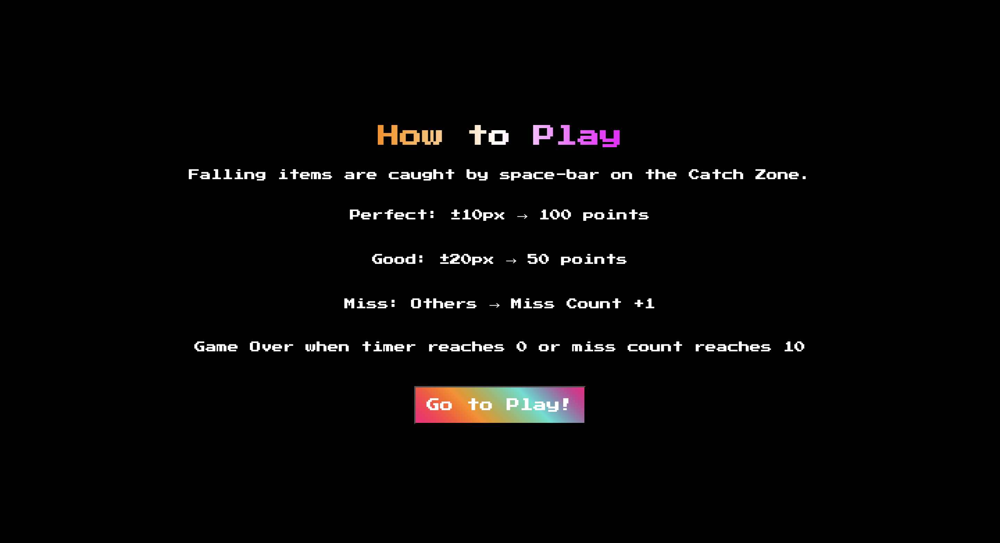
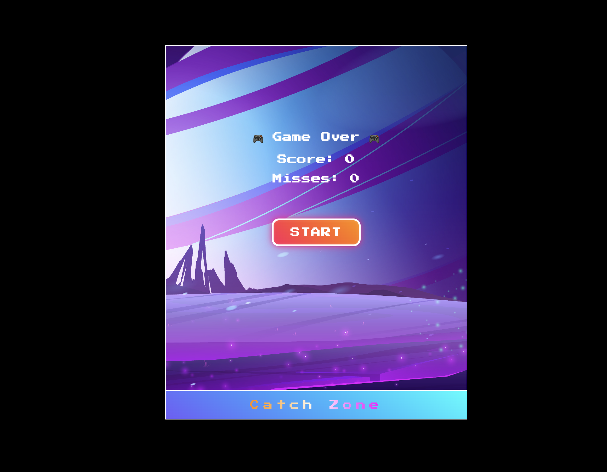
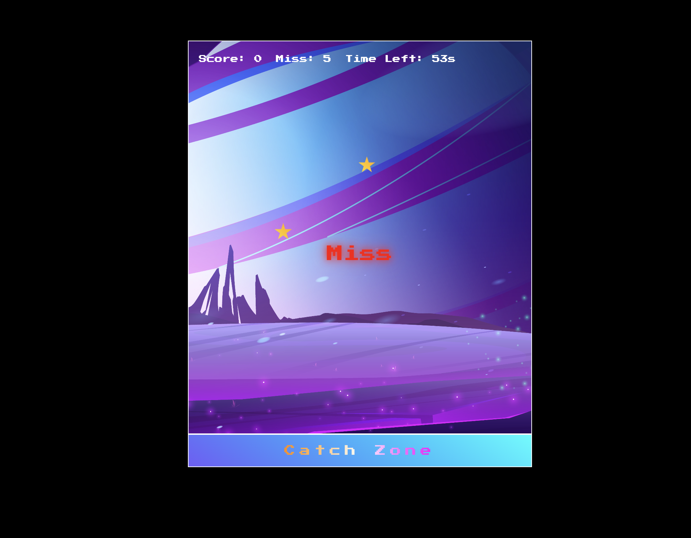
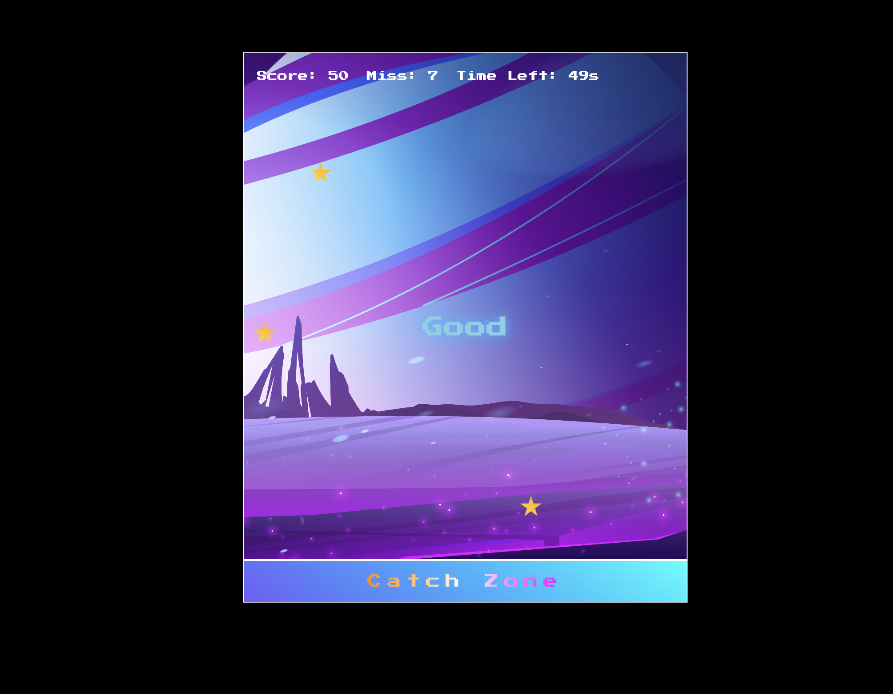

# Falling Star Catcher

**React + TypeScript** で作ったシンプルなキャッチゲームです。  
画面から落ちてくるアイテムをスペースキーで **Catch Zone** 上で受け止め、  
判定（Perfect／Good／Miss）に応じてスコアを獲得します。

---

## 🎮 遊び方

- Falling items are caught by space-bar on the Catch Zone.  
- **Perfect**：±10px → 100ポイント  
- **Good**：±20px → 50ポイント  
- **Miss**：それ以外 → ミスカウント＋1  
- タイマーが 0 になるか、ミスカウントが 10 になるとゲームオーバー

---

## 📸 スクリーンショット

### Game Over  

### プレイ中  

### Miss 表示  

### Good 表示  

### Perfect 表示  

